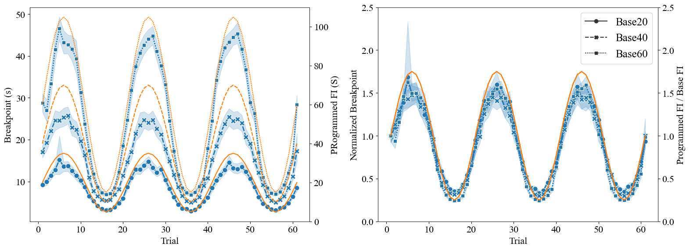
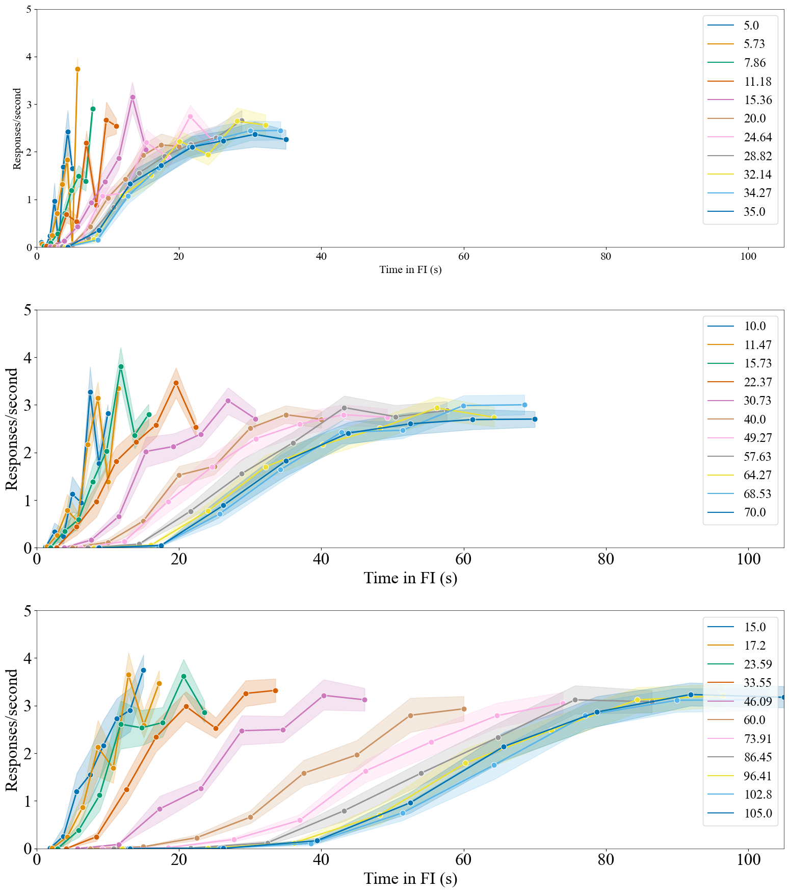
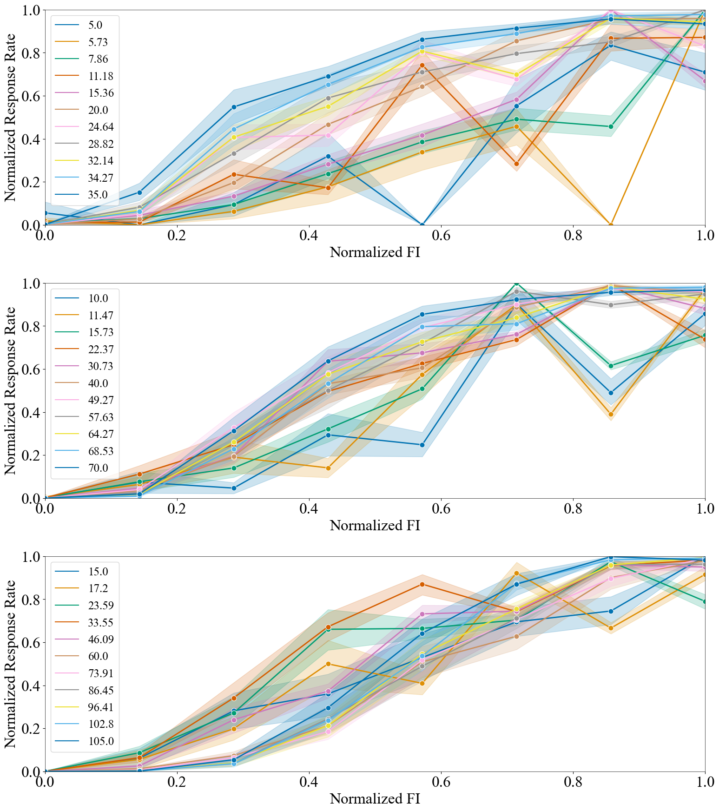
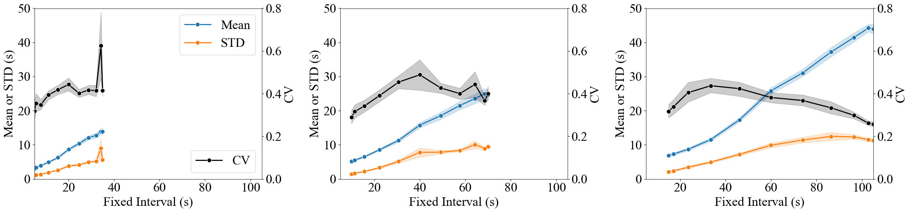
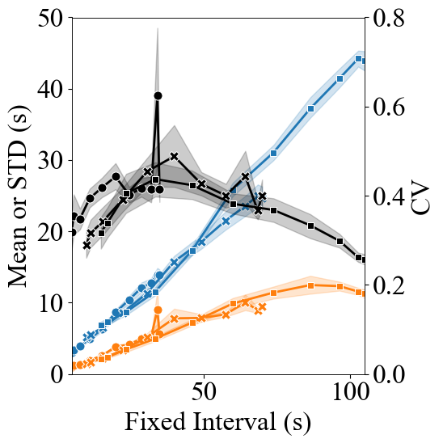

This notebook is for Daniels, Zhong, and Balsam (In Prep): Tracking of Sinusoidal Time is Not Scalar Invariant

The goal of the present work was to replicate some of the work of Staddon and colleagues using a more tradtional timing task (FI schedule) and determine whether timing is scalar invariant. This analysis is a wip and subject to change. 


```python
import numpy as np
import pandas as pd
import matplotlib as mpl
import matplotlib.pyplot as plt
import seaborn as sns
import matplotlib.font_manager as fm
import os
import re
from datetime import date
pd.set_option('display.max_rows', 10000)
import warnings
warnings.filterwarnings('ignore')
import scipy.optimize as optimization
from scipy import signal
import statsmodels.formula.api as smf
import scipy.io
mpl.rcParams['font.family'] = 'Times New Roman'
plt.rcParams['font.size'] = 16
plt.rcParams['axes.linewidth'] = 0.5
```


```python
tracked_data_e1 = pd.read_csv("exp1_updated_data.csv")
tracked_data_e1 = tracked_data_e1[["SubjectID","Session","SessionCode","Trial","ProgFI","ObtFI","Lat","Breakpoint"]]
```


```python
tracked_data_e2 = pd.read_csv("exp2_updated_data.csv")
tracked_data_e2 = tracked_data_e2[["SubjectID","Session","SessionCode","Trial","ProgFI","ObtFI","Lat","Breakpoint"]]
```


```python
all_racked_data = pd.concat([tracked_data_e1,tracked_data_e2],axis=0)
all_racked_data
```


<div>
<style scoped>
    .dataframe tbody tr th:only-of-type {
        vertical-align: middle;
    }

    .dataframe tbody tr th {
        vertical-align: top;
    }

    .dataframe thead th {
        text-align: right;
    }
</style>
<table border="1" class="dataframe">
  <thead>
    <tr style="text-align: right;">
      <th></th>
      <th>SubjectID</th>
      <th>Session</th>
      <th>SessionCode</th>
      <th>Trial</th>
      <th>ProgFI</th>
      <th>ObtFI</th>
      <th>Lat</th>
      <th>Breakpoint</th>
    </tr>
  </thead>
  <tbody>
    <tr>
      <th>0</th>
      <td>21</td>
      <td>7</td>
      <td>1</td>
      <td>1</td>
      <td>5.00</td>
      <td>7.09</td>
      <td>4.70</td>
      <td>4.70</td>
    </tr>
    <tr>
      <th>1</th>
      <td>21</td>
      <td>7</td>
      <td>1</td>
      <td>2</td>
      <td>5.00</td>
      <td>6.04</td>
      <td>1.93</td>
      <td>3.65</td>
    </tr>
    <tr>
      <th>2</th>
      <td>21</td>
      <td>7</td>
      <td>1</td>
      <td>3</td>
      <td>5.00</td>
      <td>5.40</td>
      <td>0.92</td>
      <td>2.37</td>
    </tr>
    <tr>
      <th>3</th>
      <td>21</td>
      <td>7</td>
      <td>1</td>
      <td>4</td>
      <td>5.00</td>
      <td>7.94</td>
      <td>0.92</td>
      <td>3.09</td>
    </tr>
    <tr>
      <th>4</th>
      <td>21</td>
      <td>7</td>
      <td>1</td>
      <td>5</td>
      <td>5.00</td>
      <td>5.90</td>
      <td>1.04</td>
      <td>1.59</td>
    </tr>
    <tr>
      <th>...</th>
      <td>...</td>
      <td>...</td>
      <td>...</td>
      <td>...</td>
      <td>...</td>
      <td>...</td>
      <td>...</td>
      <td>...</td>
    </tr>
    <tr>
      <th>81064</th>
      <td>181</td>
      <td>193</td>
      <td>4</td>
      <td>57</td>
      <td>22.94</td>
      <td>23.91</td>
      <td>1.22</td>
      <td>16.43</td>
    </tr>
    <tr>
      <th>81065</th>
      <td>181</td>
      <td>193</td>
      <td>4</td>
      <td>58</td>
      <td>31.46</td>
      <td>31.54</td>
      <td>1.87</td>
      <td>2.18</td>
    </tr>
    <tr>
      <th>81066</th>
      <td>181</td>
      <td>193</td>
      <td>4</td>
      <td>59</td>
      <td>44.73</td>
      <td>44.95</td>
      <td>3.82</td>
      <td>5.92</td>
    </tr>
    <tr>
      <th>81067</th>
      <td>181</td>
      <td>193</td>
      <td>4</td>
      <td>60</td>
      <td>61.46</td>
      <td>61.51</td>
      <td>4.20</td>
      <td>13.83</td>
    </tr>
    <tr>
      <th>81068</th>
      <td>181</td>
      <td>193</td>
      <td>4</td>
      <td>61</td>
      <td>80.00</td>
      <td>80.04</td>
      <td>6.47</td>
      <td>11.71</td>
    </tr>
  </tbody>
</table>
<p>185989 rows × 8 columns</p>
</div>


```python
rr_data_e1 = pd.read_csv("exp1_updated_data_rr.csv")
rr_data_e1 = rr_data_e1[["SubjectID","Session","Trial","Bin","Rsp"]]
rr_data_e2 = pd.read_csv("exp2_updated_data_rr.csv")
rr_data_e2 = rr_data_e2[["SubjectID","Session","Trial","Bin","Rsp"]]
```

Response rate as a function of time in FI analysis
Select baseline data equivalent to similar amounts of training (36 sessions in total)


```python
rr_base20_base40 = rr_data_e1[(rr_data_e1['Session']<=63) & (rr_data_e1['Session']>=51)]
#find all Base20 mice
rr_base20_base40.loc[(rr_base20_base40['SubjectID']==21) | (rr_base20_base40['SubjectID']==23) | (rr_base20_base40['SubjectID']==26) | (rr_base20_base40['SubjectID']==28) | (rr_base20_base40['SubjectID']==30) | (rr_base20_base40['SubjectID']==32) | (rr_base20_base40['SubjectID']==33) | (rr_base20_base40['SubjectID']==35),'Group']='Base20'
rr_base20_base40.loc[(rr_base20_base40['SubjectID']==22) | (rr_base20_base40['SubjectID']==24) | (rr_base20_base40['SubjectID']==25) | (rr_base20_base40['SubjectID']==27) | (rr_base20_base40['SubjectID']==29) | (rr_base20_base40['SubjectID']==31) | (rr_base20_base40['SubjectID']==34) | (rr_base20_base40['SubjectID']==36),'Group']='Base40'
#Replace session 50 with 63 because of operant chamber malfunction
rr_base20_base40[(rr_base20_base40['SubjectID']>=29) & (rr_base20_base40['Session']==50)] = rr_base20_base40[(rr_base20_base40['SubjectID']>=29) & (rr_base20_base40['Session']==63)]
#Drop session 63 because not needed for baseline
rr_base20_base40 = rr_base20_base40[rr_base20_base40['Session']<=62]
```


```python
#Organize baseline of e2 data (Base 60)
rr_base60 = rr_data_e2[(rr_data_e2['Session']<=62) & (rr_data_e2['Session']>= 51)]
#Add group identifier
rr_base60['Group' ] = 'Base60'
```


```python
#concatenate all data
all_rr_base = pd.concat([rr_base20_base40,rr_base60],axis=0)
```


```python
all_rr_base
```


<div>
<style scoped>
    .dataframe tbody tr th:only-of-type {
        vertical-align: middle;
    }

    .dataframe tbody tr th {
        vertical-align: top;
    }

    .dataframe thead th {
        text-align: right;
    }
</style>
<table border="1" class="dataframe">
  <thead>
    <tr style="text-align: right;">
      <th></th>
      <th>SubjectID</th>
      <th>Session</th>
      <th>Trial</th>
      <th>Bin</th>
      <th>Rsp</th>
      <th>Group</th>
    </tr>
  </thead>
  <tbody>
    <tr>
      <th>343552</th>
      <td>21</td>
      <td>51</td>
      <td>0</td>
      <td>0</td>
      <td>0.000000</td>
      <td>Base20</td>
    </tr>
    <tr>
      <th>343553</th>
      <td>21</td>
      <td>51</td>
      <td>0</td>
      <td>1</td>
      <td>0.000000</td>
      <td>Base20</td>
    </tr>
    <tr>
      <th>343554</th>
      <td>21</td>
      <td>51</td>
      <td>0</td>
      <td>2</td>
      <td>0.800000</td>
      <td>Base20</td>
    </tr>
    <tr>
      <th>343555</th>
      <td>21</td>
      <td>51</td>
      <td>0</td>
      <td>3</td>
      <td>1.600000</td>
      <td>Base20</td>
    </tr>
    <tr>
      <th>343556</th>
      <td>21</td>
      <td>51</td>
      <td>0</td>
      <td>4</td>
      <td>2.800000</td>
      <td>Base20</td>
    </tr>
    <tr>
      <th>...</th>
      <td>...</td>
      <td>...</td>
      <td>...</td>
      <td>...</td>
      <td>...</td>
      <td>...</td>
    </tr>
    <tr>
      <th>202027</th>
      <td>184</td>
      <td>62</td>
      <td>60</td>
      <td>3</td>
      <td>0.000000</td>
      <td>Base60</td>
    </tr>
    <tr>
      <th>202028</th>
      <td>184</td>
      <td>62</td>
      <td>60</td>
      <td>4</td>
      <td>1.066667</td>
      <td>Base60</td>
    </tr>
    <tr>
      <th>202029</th>
      <td>184</td>
      <td>62</td>
      <td>60</td>
      <td>5</td>
      <td>3.466667</td>
      <td>Base60</td>
    </tr>
    <tr>
      <th>202030</th>
      <td>184</td>
      <td>62</td>
      <td>60</td>
      <td>6</td>
      <td>4.533333</td>
      <td>Base60</td>
    </tr>
    <tr>
      <th>202031</th>
      <td>184</td>
      <td>62</td>
      <td>60</td>
      <td>7</td>
      <td>3.733333</td>
      <td>Base60</td>
    </tr>
  </tbody>
</table>
<p>140544 rows × 6 columns</p>
</div>


```python
#Add FI information to RR
for subj in all_rr_base.SubjectID.unique():
    for sess in all_rr_base[all_rr_base['SubjectID']==subj].Session.unique():
        all_rr_base.loc[(all_rr_base['SubjectID']==subj) & (all_rr_base['Session']==sess),'ProgFI'] = np.repeat(all_racked_data[(all_racked_data['SubjectID']==subj) & (all_racked_data['Session']==sess)].ProgFI.to_numpy(),8)
        
all_rr_base['LogRate'] = np.log(all_rr_base.Rsp+0.001)
```


```python
#Add ascending and dscending information to lat and bp data
for subj in all_racked_data.SubjectID.unique():
    for sess in all_racked_data[all_racked_data['SubjectID']==subj].Session.unique():
        if all_racked_data[(all_racked_data['SubjectID']==subj) & (all_racked_data['Session']==sess)].ProgFI.to_numpy()[0] - all_racked_data[(all_racked_data['SubjectID']==subj) & (all_racked_data['Session']==sess)].ProgFI.to_numpy()[1] == 0:
            all_racked_data.loc[(all_racked_data['SubjectID']==subj) & (all_racked_data['Session']==sess),'Direction'] = 'Static'
        elif all_racked_data[(all_racked_data['SubjectID']==subj) & (all_racked_data['Session']==sess)].ProgFI.to_numpy()[0] - all_racked_data[(all_racked_data['SubjectID']==subj) & (all_racked_data['Session']==sess)].ProgFI.to_numpy()[1] < 0:
            all_racked_data.loc[(all_racked_data['SubjectID']==subj) & (all_racked_data['Session']==sess),'Direction'] = 'Ascending'
        else:
            all_racked_data.loc[(all_racked_data['SubjectID']==subj) & (all_racked_data['Session']==sess),'Direction'] = 'Descending'
```


```python
print(all_racked_data)
```

           SubjectID  Session  SessionCode  Trial  ProgFI  ObtFI   Lat  \
    0             21        7            1      1    5.00   7.09  4.70   
    1             21        7            1      2    5.00   6.04  1.93   
    2             21        7            1      3    5.00   5.40  0.92   
    3             21        7            1      4    5.00   7.94  0.92   
    4             21        7            1      5    5.00   5.90  1.04   
    ...          ...      ...          ...    ...     ...    ...   ...   
    81064        181      193            4     57   22.94  23.91  1.22   
    81065        181      193            4     58   31.46  31.54  1.87   
    81066        181      193            4     59   44.73  44.95  3.82   
    81067        181      193            4     60   61.46  61.51  4.20   
    81068        181      193            4     61   80.00  80.04  6.47   
    
           Breakpoint  Direction  
    0            4.70     Static  
    1            3.65     Static  
    2            2.37     Static  
    3            3.09     Static  
    4            1.59     Static  
    ...           ...        ...  
    81064       16.43  Ascending  
    81065        2.18  Ascending  
    81066        5.92  Ascending  
    81067       13.83  Ascending  
    81068       11.71  Ascending  
    
    [185989 rows x 9 columns]
    


```python
#Calculate response rate/bin for each FI
fi_rr = all_rr_base.LogRate.groupby([all_rr_base['SubjectID'],all_rr_base['Group'],all_rr_base['ProgFI'],all_rr_base['Bin']]).mean()
fi_rr = fi_rr.reset_index()
fi_rr['ExpRate'] = np.exp(fi_rr.LogRate) - 0.001
fi_rr['UnBin'] = (fi_rr.Bin+1)*(fi_rr.ProgFI*(1/8))
fi_rr['PropBin'] = fi_rr.Bin/7
for subj in fi_rr.SubjectID.unique():
    for FI in fi_rr.ProgFI[fi_rr['SubjectID']==subj].unique():
        fi_rr.loc[(fi_rr['SubjectID']==subj) & (fi_rr['ProgFI']==FI), 'PropRate'] = fi_rr.ExpRate[(fi_rr['SubjectID']==subj) & (fi_rr['ProgFI']==FI)]/np.max(fi_rr.ExpRate[(fi_rr['SubjectID']==subj) & (fi_rr['ProgFI']==FI)])

```


```python
racked_base20_base40 = tracked_data_e1[(tracked_data_e1['Session']<=63) & (tracked_data_e1['Session']>=51)]
#find all Base20 mice
racked_base20_base40.loc[(racked_base20_base40['SubjectID']==21) | (racked_base20_base40['SubjectID']==23) | (racked_base20_base40['SubjectID']==26) | (racked_base20_base40['SubjectID']==28) | (racked_base20_base40['SubjectID']==30) | (racked_base20_base40['SubjectID']==32) | (racked_base20_base40['SubjectID']==33) | (racked_base20_base40['SubjectID']==35),'Group']='Base20'
racked_base20_base40.loc[(racked_base20_base40['SubjectID']==22) | (racked_base20_base40['SubjectID']==24) | (racked_base20_base40['SubjectID']==25) | (racked_base20_base40['SubjectID']==27) | (racked_base20_base40['SubjectID']==29) | (racked_base20_base40['SubjectID']==31) | (racked_base20_base40['SubjectID']==34) | (racked_base20_base40['SubjectID']==36),'Group']='Base40'
#Replace session 50 with 63 because of operant chamber malfunction
racked_base20_base40[(racked_base20_base40['SubjectID']>=29) & (racked_base20_base40['Session']==50)] = racked_base20_base40[(racked_base20_base40['SubjectID']>=29) & (racked_base20_base40['Session']==63)]
#Drop session 63 because not needed for baseline
racked_base20_base40 = racked_base20_base40[racked_base20_base40['Session']<=62]
```


```python
#Organize baseline of e2 data (Base 60)
racked_base60 = tracked_data_e2[(tracked_data_e2['Session']<=62) & (tracked_data_e2['Session']>= 51)]
#Add group identifier
racked_base60['Group' ] = 'Base60'
```


```python
#recombine data again
all_racked_base = pd.concat([racked_base20_base40,racked_base60],axis=0)
all_racked_base['LogLat'] = np.log(all_racked_base.Lat)
all_racked_base['LogBP'] = np.log(all_racked_base.Lat)
```


```python
for subj in all_racked_base.SubjectID.unique():
    for sess in all_racked_base[all_racked_base['SubjectID']==subj].Session.unique():
        if all_racked_base[(all_racked_base['SubjectID']==subj) & (all_racked_base['Session']==sess)].ProgFI.to_numpy()[0] - all_racked_base[(all_racked_base['SubjectID']==subj) & (all_racked_base['Session']==sess)].ProgFI.to_numpy()[1] == 0:
            all_racked_base.loc[(all_racked_base['SubjectID']==subj) & (all_racked_base['Session']==sess),'Direction'] = 'Static'
        elif all_racked_base[(all_racked_base['SubjectID']==subj) & (all_racked_base['Session']==sess)].ProgFI.to_numpy()[0] - all_racked_base[(all_racked_base['SubjectID']==subj) & (all_racked_base['Session']==sess)].ProgFI.to_numpy()[1] < 0:
            all_racked_base.loc[(all_racked_base['SubjectID']==subj) & (all_racked_base['Session']==sess),'Direction'] = 'Ascending'
        else:
            all_racked_base.loc[(all_racked_base['SubjectID']==subj) & (all_racked_base['Session']==sess),'Direction'] = 'Descending'
```


```python
experimental_data = all_racked_base
for subj in experimental_data.SubjectID.unique():
    for sess in experimental_data[experimental_data['SubjectID']==subj].Session.unique():
        Progtemp = experimental_data[(experimental_data['SubjectID']==subj) & (experimental_data['Session']==sess)].ProgFI.to_numpy()
        BPtemp = experimental_data[(experimental_data['SubjectID']==subj) & (experimental_data['Session']==sess)].Breakpoint.to_numpy()
        Lattemp = experimental_data[(experimental_data['SubjectID']==subj) & (experimental_data['Session']==sess)].Lat.to_numpy()
        if Progtemp[0] - Progtemp[1] > 0:
            experimental_data.loc[(experimental_data['SubjectID']==subj) & (experimental_data['Session']==sess),'ProgFI']= np.flip(Progtemp)
            experimental_data.loc[(experimental_data['SubjectID']==subj) & (experimental_data['Session']==sess),'Breakpoint'] = np.flip(BPtemp)
            experimental_data.loc[(experimental_data['SubjectID']==subj) & (experimental_data['Session']==sess),'Lat'] = np.flip(Lattemp)
print(experimental_data)
```

           SubjectID  Session  SessionCode  Trial  ProgFI  ObtFI    Lat  \
    42944         21       51            4      1   20.00  20.09   3.06   
    42945         21       51            4      2   24.64  24.83   0.51   
    42946         21       51            4      3   28.82  29.07   5.40   
    42947         21       51            4      4   32.14  32.30   4.43   
    42948         21       51            4      5   34.27  34.74   4.40   
    ...          ...      ...          ...    ...     ...    ...    ...   
    25249        184       62            4     57   17.20  17.59   3.48   
    25250        184       62            4     58   23.59  24.08   3.18   
    25251        184       62            4     59   33.55  33.77   4.86   
    25252        184       62            4     60   46.09  46.13  15.00   
    25253        184       62            4     61   60.00  60.02  31.50   
    
           Breakpoint   Group    LogLat     LogBP  Direction  
    42944        8.74  Base20  1.118415  1.118415  Ascending  
    42945        5.11  Base20 -0.673345 -0.673345  Ascending  
    42946        9.01  Base20  1.686399  1.686399  Ascending  
    42947       17.08  Base20  1.488400  1.488400  Ascending  
    42948       11.47  Base20  1.481605  1.481605  Ascending  
    ...           ...     ...       ...       ...        ...  
    25249        8.71  Base60  1.247032  1.247032  Ascending  
    25250        6.90  Base60  1.156881  1.156881  Ascending  
    25251       19.21  Base60  1.581038  1.581038  Ascending  
    25252       15.00  Base60  2.708050  2.708050  Ascending  
    25253       31.50  Base60  3.449988  3.449988  Ascending  
    
    [17568 rows x 12 columns]
    


```python
experimental_data['NormBP'] = experimental_data.Breakpoint
experimental_data['NormFI'] = experimental_data.ProgFI
baseFI_means = experimental_data.Breakpoint.groupby([experimental_data['Group'],experimental_data['SubjectID'],experimental_data['Trial']]).mean().reset_index()

for subj in experimental_data.SubjectID.unique():
    #norm BPs first
    temp = experimental_data.Breakpoint[experimental_data['SubjectID']==subj]
    temp2 = baseFI_means.Breakpoint[baseFI_means['SubjectID']==subj].iloc[0]
    temp3 = temp/temp2
    experimental_data.loc[experimental_data['SubjectID']==subj,'NormBP'] = temp3
    
    #norm ProgFI second
    temp = experimental_data.ProgFI[experimental_data['SubjectID']==subj]
    temp2 = temp/temp.iloc[0]
    experimental_data.loc[experimental_data['SubjectID']==subj,'NormFI'] = temp2
    
#calculated for later use
baseFI_means = experimental_data.Breakpoint.groupby([experimental_data['Group'],experimental_data['SubjectID'],experimental_data['Trial']]).mean().reset_index()
baseFI_means['NormBP'] = experimental_data.NormBP.groupby([experimental_data['Group'],experimental_data['SubjectID'],experimental_data['Trial']]).mean().reset_index().NormBP
baseFI_means['NormFI'] = experimental_data.NormFI.groupby([experimental_data['Group'],experimental_data['SubjectID'],experimental_data['Trial']]).mean().reset_index().NormFI
```

First we want to know whether the mean breakpoint as a function of trial in the session is scalar invariant. The graphs below are a visual test.


```python
fig1 = plt.figure(figsize=(16,6))
plt.subplot(1,2,1)
sns.lineplot(data=experimental_data,x="Trial",y="Breakpoint",style="Group", markers = True, color="tab:blue",markersize=8,linewidth=2,legend=None)
plt.ylabel("Breakpoint (s)")
plt.twinx()
sns.lineplot(data=experimental_data,x="Trial",y="ProgFI",style="Group", color="tab:orange",legend=None)
plt.ylabel("PRogrammed FI (S)")
plt.subplot(1,2,2)
sns.lineplot(data=experimental_data,x="Trial",y="NormBP",style="Group", markers = True, color="tab:blue",markersize=8,linewidth=2)
plt.legend(fontsize=18,loc="best")
plt.ylabel("Normalized Breakpoint")
plt.ylim(0,2.5)
plt.twinx()
sns.lineplot(data=experimental_data,x="Trial",y="NormFI",style="Group", color="tab:orange",legend=None)
plt.ylabel("Programmed FI / Base FI")
plt.ylim(0,2.5)
plt.tight_layout()
plt.show()
fig1.savefig("CyclicFig1.png")
```


    

    


```python
#Fit Sinewave eqution to raw data; assess estimates
#Define the  function
def SW(x,B,S,P):
    return B + (S * np.sin((2  * np.pi * (x-1)) / P))

model_collection = pd.DataFrame({'SubjectID' : [], 'Model': [], 'B': [],'Sm': [],'P': [],'AICc':[]})
selected = []
for subj in baseFI_means.SubjectID.unique():
    temp = baseFI_means[baseFI_means['SubjectID']==subj]
    x = temp.Trial.to_numpy()
    y = temp.Breakpoint.to_numpy()
    SWparams = [np.nanmean(y),np.amax(y)-np.nanmean(y),20]
    SWbest_vals = optimization.curve_fit(SW, x, y, SWparams)
    SWres = (2*3)+(61*np.log(np.sum(np.square(SW(x,*SWbest_vals[0])-y)))) + (((2*(np.square(3)))+(2*3))/(61-3-1))
    SWfit = SW(x,*SWbest_vals[0])
    model_collection=model_collection.append({'SubjectID':subj,'Model': 'SineWave','B':SWbest_vals[0][0],'Sm':SWbest_vals[0][1],'P':SWbest_vals[0][2],'AICc':SWres},ignore_index=True)
    baseFI_means.loc[baseFI_means['SubjectID']==subj,'SWfit_raw'] = SWfit
    
raw_model_collect = model_collection
```


```python
raw_model_collect
```


<div>
<style scoped>
    .dataframe tbody tr th:only-of-type {
        vertical-align: middle;
    }

    .dataframe tbody tr th {
        vertical-align: top;
    }

    .dataframe thead th {
        text-align: right;
    }
</style>
<table border="1" class="dataframe">
  <thead>
    <tr style="text-align: right;">
      <th></th>
      <th>SubjectID</th>
      <th>Model</th>
      <th>B</th>
      <th>Sm</th>
      <th>P</th>
      <th>AICc</th>
    </tr>
  </thead>
  <tbody>
    <tr>
      <th>0</th>
      <td>21.0</td>
      <td>SineWave</td>
      <td>9.167060</td>
      <td>5.629437</td>
      <td>19.963965</td>
      <td>279.102697</td>
    </tr>
    <tr>
      <th>1</th>
      <td>23.0</td>
      <td>SineWave</td>
      <td>9.792936</td>
      <td>6.716153</td>
      <td>19.993769</td>
      <td>289.174974</td>
    </tr>
    <tr>
      <th>2</th>
      <td>26.0</td>
      <td>SineWave</td>
      <td>9.680059</td>
      <td>7.247549</td>
      <td>20.063507</td>
      <td>270.677062</td>
    </tr>
    <tr>
      <th>3</th>
      <td>28.0</td>
      <td>SineWave</td>
      <td>8.711062</td>
      <td>6.730590</td>
      <td>19.934390</td>
      <td>354.401954</td>
    </tr>
    <tr>
      <th>4</th>
      <td>30.0</td>
      <td>SineWave</td>
      <td>6.679886</td>
      <td>3.418922</td>
      <td>20.145356</td>
      <td>241.679840</td>
    </tr>
    <tr>
      <th>5</th>
      <td>32.0</td>
      <td>SineWave</td>
      <td>8.936144</td>
      <td>5.585727</td>
      <td>20.075345</td>
      <td>270.498554</td>
    </tr>
    <tr>
      <th>6</th>
      <td>33.0</td>
      <td>SineWave</td>
      <td>8.057175</td>
      <td>5.148310</td>
      <td>19.905699</td>
      <td>289.688153</td>
    </tr>
    <tr>
      <th>7</th>
      <td>35.0</td>
      <td>SineWave</td>
      <td>6.852787</td>
      <td>4.445026</td>
      <td>19.993758</td>
      <td>258.500655</td>
    </tr>
    <tr>
      <th>8</th>
      <td>22.0</td>
      <td>SineWave</td>
      <td>12.246227</td>
      <td>8.386300</td>
      <td>19.949323</td>
      <td>345.047449</td>
    </tr>
    <tr>
      <th>9</th>
      <td>24.0</td>
      <td>SineWave</td>
      <td>16.566061</td>
      <td>10.942042</td>
      <td>19.927461</td>
      <td>367.685786</td>
    </tr>
    <tr>
      <th>10</th>
      <td>25.0</td>
      <td>SineWave</td>
      <td>18.941785</td>
      <td>14.179581</td>
      <td>19.961837</td>
      <td>303.695297</td>
    </tr>
    <tr>
      <th>11</th>
      <td>27.0</td>
      <td>SineWave</td>
      <td>17.161865</td>
      <td>13.147941</td>
      <td>19.968051</td>
      <td>369.315076</td>
    </tr>
    <tr>
      <th>12</th>
      <td>29.0</td>
      <td>SineWave</td>
      <td>13.774732</td>
      <td>8.486622</td>
      <td>20.207803</td>
      <td>345.942028</td>
    </tr>
    <tr>
      <th>13</th>
      <td>31.0</td>
      <td>SineWave</td>
      <td>15.286488</td>
      <td>10.575562</td>
      <td>19.969379</td>
      <td>313.508085</td>
    </tr>
    <tr>
      <th>14</th>
      <td>34.0</td>
      <td>SineWave</td>
      <td>14.143511</td>
      <td>8.227329</td>
      <td>20.086882</td>
      <td>332.139845</td>
    </tr>
    <tr>
      <th>15</th>
      <td>36.0</td>
      <td>SineWave</td>
      <td>13.046688</td>
      <td>9.129292</td>
      <td>19.996840</td>
      <td>317.194144</td>
    </tr>
    <tr>
      <th>16</th>
      <td>177.0</td>
      <td>SineWave</td>
      <td>28.103276</td>
      <td>23.254815</td>
      <td>19.967195</td>
      <td>424.655943</td>
    </tr>
    <tr>
      <th>17</th>
      <td>178.0</td>
      <td>SineWave</td>
      <td>25.822413</td>
      <td>19.863253</td>
      <td>19.949192</td>
      <td>376.075397</td>
    </tr>
    <tr>
      <th>18</th>
      <td>179.0</td>
      <td>SineWave</td>
      <td>24.959571</td>
      <td>19.628152</td>
      <td>20.012117</td>
      <td>398.415148</td>
    </tr>
    <tr>
      <th>19</th>
      <td>180.0</td>
      <td>SineWave</td>
      <td>26.290651</td>
      <td>23.185217</td>
      <td>19.947631</td>
      <td>424.694992</td>
    </tr>
    <tr>
      <th>20</th>
      <td>181.0</td>
      <td>SineWave</td>
      <td>23.089873</td>
      <td>17.825581</td>
      <td>20.002265</td>
      <td>377.749746</td>
    </tr>
    <tr>
      <th>21</th>
      <td>182.0</td>
      <td>SineWave</td>
      <td>25.192084</td>
      <td>16.874266</td>
      <td>20.030418</td>
      <td>363.760774</td>
    </tr>
    <tr>
      <th>22</th>
      <td>183.0</td>
      <td>SineWave</td>
      <td>21.804179</td>
      <td>17.308219</td>
      <td>19.980322</td>
      <td>375.592982</td>
    </tr>
    <tr>
      <th>23</th>
      <td>184.0</td>
      <td>SineWave</td>
      <td>24.950977</td>
      <td>21.222860</td>
      <td>19.938310</td>
      <td>380.133368</td>
    </tr>
  </tbody>
</table>
</div>


```python
model_collection = pd.DataFrame({'SubjectID' : [], 'Model': [], 'B': [],'Sm': [],'P': [],'AICc':[]})
selected = []
for subj in baseFI_means.SubjectID.unique():
    temp = baseFI_means[baseFI_means['SubjectID']==subj]
    x = temp.Trial.to_numpy()
    y = temp.NormBP.to_numpy()
    SWparams = [np.nanmean(y),np.amax(y)-np.nanmean(y),20]
    SWbest_vals = optimization.curve_fit(SW, x, y, SWparams)
    SWres = (2*3)+(61*np.log(np.sum(np.square(SW(x,*SWbest_vals[0])-y)))) + (((2*(np.square(3)))+(2*3))/(61-3-1))
    SWfit = SW(x,*SWbest_vals[0])
    model_collection=model_collection.append({'SubjectID':subj,'Model': 'SineWave','B':SWbest_vals[0][0],'Sm':SWbest_vals[0][1],'P':SWbest_vals[0][2],'AICc':SWres},ignore_index=True)
    baseFI_means.loc[baseFI_means['SubjectID']==subj,'SWfit_norm'] = SWfit
    
norm_model_collect = model_collection
```


```python
norm_model_collect
```


<div>
<style scoped>
    .dataframe tbody tr th:only-of-type {
        vertical-align: middle;
    }

    .dataframe tbody tr th {
        vertical-align: top;
    }

    .dataframe thead th {
        text-align: right;
    }
</style>
<table border="1" class="dataframe">
  <thead>
    <tr style="text-align: right;">
      <th></th>
      <th>SubjectID</th>
      <th>Model</th>
      <th>B</th>
      <th>Sm</th>
      <th>P</th>
      <th>AICc</th>
    </tr>
  </thead>
  <tbody>
    <tr>
      <th>0</th>
      <td>21.0</td>
      <td>SineWave</td>
      <td>1.043490</td>
      <td>0.640801</td>
      <td>19.963965</td>
      <td>13.991119</td>
    </tr>
    <tr>
      <th>1</th>
      <td>23.0</td>
      <td>SineWave</td>
      <td>0.971280</td>
      <td>0.666120</td>
      <td>19.993769</td>
      <td>7.257222</td>
    </tr>
    <tr>
      <th>2</th>
      <td>26.0</td>
      <td>SineWave</td>
      <td>1.013707</td>
      <td>0.758972</td>
      <td>20.063507</td>
      <td>-4.610313</td>
    </tr>
    <tr>
      <th>3</th>
      <td>28.0</td>
      <td>SineWave</td>
      <td>0.944203</td>
      <td>0.729537</td>
      <td>19.934390</td>
      <td>83.317036</td>
    </tr>
    <tr>
      <th>4</th>
      <td>30.0</td>
      <td>SineWave</td>
      <td>1.019182</td>
      <td>0.521641</td>
      <td>20.145356</td>
      <td>12.307521</td>
    </tr>
    <tr>
      <th>5</th>
      <td>32.0</td>
      <td>SineWave</td>
      <td>0.937440</td>
      <td>0.585967</td>
      <td>20.075345</td>
      <td>-4.575702</td>
    </tr>
    <tr>
      <th>6</th>
      <td>33.0</td>
      <td>SineWave</td>
      <td>0.823631</td>
      <td>0.526278</td>
      <td>19.905699</td>
      <td>11.455554</td>
    </tr>
    <tr>
      <th>7</th>
      <td>35.0</td>
      <td>SineWave</td>
      <td>0.676763</td>
      <td>0.438979</td>
      <td>19.993758</td>
      <td>-23.940315</td>
    </tr>
    <tr>
      <th>8</th>
      <td>22.0</td>
      <td>SineWave</td>
      <td>0.831192</td>
      <td>0.569206</td>
      <td>19.949323</td>
      <td>16.853724</td>
    </tr>
    <tr>
      <th>9</th>
      <td>24.0</td>
      <td>SineWave</td>
      <td>0.864429</td>
      <td>0.570964</td>
      <td>19.927461</td>
      <td>7.414635</td>
    </tr>
    <tr>
      <th>10</th>
      <td>25.0</td>
      <td>SineWave</td>
      <td>0.949146</td>
      <td>0.710519</td>
      <td>19.961837</td>
      <td>-61.519421</td>
    </tr>
    <tr>
      <th>11</th>
      <td>27.0</td>
      <td>SineWave</td>
      <td>0.939647</td>
      <td>0.719876</td>
      <td>19.968051</td>
      <td>14.912270</td>
    </tr>
    <tr>
      <th>12</th>
      <td>29.0</td>
      <td>SineWave</td>
      <td>0.903014</td>
      <td>0.556348</td>
      <td>20.207803</td>
      <td>13.510000</td>
    </tr>
    <tr>
      <th>13</th>
      <td>31.0</td>
      <td>SineWave</td>
      <td>0.942447</td>
      <td>0.652008</td>
      <td>19.969379</td>
      <td>-26.413811</td>
    </tr>
    <tr>
      <th>14</th>
      <td>34.0</td>
      <td>SineWave</td>
      <td>0.889716</td>
      <td>0.517551</td>
      <td>20.086882</td>
      <td>-5.325507</td>
    </tr>
    <tr>
      <th>15</th>
      <td>36.0</td>
      <td>SineWave</td>
      <td>0.763225</td>
      <td>0.534059</td>
      <td>19.996840</td>
      <td>-29.131804</td>
    </tr>
    <tr>
      <th>16</th>
      <td>177.0</td>
      <td>SineWave</td>
      <td>0.852476</td>
      <td>0.705404</td>
      <td>19.967195</td>
      <td>-1.794685</td>
    </tr>
    <tr>
      <th>17</th>
      <td>178.0</td>
      <td>SineWave</td>
      <td>0.916474</td>
      <td>0.704975</td>
      <td>19.949192</td>
      <td>-31.217289</td>
    </tr>
    <tr>
      <th>18</th>
      <td>179.0</td>
      <td>SineWave</td>
      <td>0.861467</td>
      <td>0.677456</td>
      <td>20.012117</td>
      <td>-12.282707</td>
    </tr>
    <tr>
      <th>19</th>
      <td>180.0</td>
      <td>SineWave</td>
      <td>0.733727</td>
      <td>0.647059</td>
      <td>19.947631</td>
      <td>-11.922518</td>
    </tr>
    <tr>
      <th>20</th>
      <td>181.0</td>
      <td>SineWave</td>
      <td>0.981504</td>
      <td>0.757729</td>
      <td>20.002265</td>
      <td>-7.534023</td>
    </tr>
    <tr>
      <th>21</th>
      <td>182.0</td>
      <td>SineWave</td>
      <td>0.902457</td>
      <td>0.604487</td>
      <td>20.030418</td>
      <td>-42.397255</td>
    </tr>
    <tr>
      <th>22</th>
      <td>183.0</td>
      <td>SineWave</td>
      <td>0.861088</td>
      <td>0.683534</td>
      <td>19.980322</td>
      <td>-18.669589</td>
    </tr>
    <tr>
      <th>23</th>
      <td>184.0</td>
      <td>SineWave</td>
      <td>0.894193</td>
      <td>0.760585</td>
      <td>19.938310</td>
      <td>-25.973663</td>
    </tr>
  </tbody>
</table>
</div>


```python
#Here exporting the model fits to .csvs to be analyzed in R
raw_model_collect.to_csv("raw_sinewaveFits.csv")
norm_model_collect.to_csv("norm_sinewaveFits.csv")
```


```python
#Calculate response rate/bin for each FI
fi_rr = all_rr_base.LogRate.groupby([all_rr_base['SubjectID'],all_rr_base['Group'],all_rr_base['ProgFI'],all_rr_base['Bin']]).mean()
fi_rr = fi_rr.reset_index()
fi_rr['ExpRate'] = np.exp(fi_rr.LogRate) - 0.001
fi_rr['UnBin'] = (fi_rr.Bin+1)*(fi_rr.ProgFI*(1/8))
fi_rr['PropBin'] = fi_rr.Bin/7
for subj in fi_rr.SubjectID.unique():
    for FI in fi_rr.ProgFI[fi_rr['SubjectID']==subj].unique():
        fi_rr.loc[(fi_rr['SubjectID']==subj) & (fi_rr['ProgFI']==FI), 'PropRate'] = fi_rr.ExpRate[(fi_rr['SubjectID']==subj) & (fi_rr['ProgFI']==FI)]/np.max(fi_rr.ExpRate[(fi_rr['SubjectID']==subj) & (fi_rr['ProgFI']==FI)])

```

Next we asked if the scalar invariance observed in the previous graphs would be observed in the response function where response rates are plotted as a function of time for each FI in the sine wave. 


```python
fig2 = plt.figure(figsize=(16,18),tight_layout=True)
for i,group in enumerate(fi_rr.Group.unique(),start=1):
    temp = fi_rr[fi_rr['Group']==group]
    plt.subplot(3,1,i)
    plt.rc('font',size=24)
    sns.lineplot(data=temp,x='UnBin',y='ExpRate',hue='ProgFI',palette="colorblind",markers=True,dashes=False,marker='o',ci=68,markersize=8,linewidth=2)
    plt.ylim([0,5])
    plt.xlim(0,105)
    plt.xlabel('Time in FI (s)')
    plt.ylabel('Responses/second')
    plt.legend(fontsize=18)
plt.show()
fig2.savefig('CyclicFig2.png')
```


    

    


```python
fig3 = plt.figure(figsize=(16,18),tight_layout=True)
for i,group in enumerate(fi_rr.Group.unique(),start=1):
    temp = fi_rr[fi_rr['Group']==group]
    plt.subplot(3,1,i)
    plt.rc('font',size=24)
    sns.lineplot(data=temp,x='PropBin',y='PropRate',hue='ProgFI',palette="colorblind",markers=True,dashes=False,marker='o',ci=68,markersize=8,linewidth=2)
    plt.ylim([0,1])
    plt.xlim(0,1)
    plt.xlabel('Normalized FI')
    plt.ylabel('Normalized Response Rate')
    plt.legend(fontsize=18)
plt.show()
fig3.savefig('CyclicFig3.png')
```


    

    


```python
#fit logistic function
def cumWBL(x,A,L,k):
    return A*(1-np.exp(-pow(x/L,k)))

model_collection = pd.DataFrame({'SubjectID' : [], 'ProgFI': [],'A': [],'L': [],'K': []})

for subj in fi_rr.SubjectID.unique():
    temp = fi_rr[fi_rr['SubjectID']==subj]
    for progFI in temp.ProgFI.unique():
        temp2 = temp[temp['ProgFI']==progFI]
        x = temp2.UnBin.to_numpy()
        y = temp2.ExpRate.to_numpy()
        WBLparams = [max(y)+0.5,np.nanmean(x)+2,5]
        wbl_bounds = (0.01,[max(y)*2, max(x)*2,100])
        WBLbest_vals = optimization.curve_fit(cumWBL, x, y, WBLparams, bounds = wbl_bounds, maxfev=10000)
        SWfit = cumWBL(x,*SWbest_vals[0])
        model_collection=model_collection.append({'SubjectID':subj,'ProgFI':progFI,'A':WBLbest_vals[0][0],'L':WBLbest_vals[0][1],'K':WBLbest_vals[0][2]},ignore_index=True)
        #baseFI_means.loc[baseFI_means['SubjectID']==subj,'SWfit_norm'] = SWfit
        
raw_WBL_fits = model_collection
```


```python
model_collection = pd.DataFrame({'SubjectID' : [], 'ProgFI': [],'A': [],'L': [],'K': []})

for subj in fi_rr.SubjectID.unique():
    temp = fi_rr[fi_rr['SubjectID']==subj]
    for progFI in temp.ProgFI.unique():
        temp2 = temp[temp['ProgFI']==progFI]
        x = temp2.PropBin.to_numpy()
        y = temp2.PropRate.to_numpy()
        WBLparams = [max(y)+0.5,np.nanmean(x)+0.25,5]
        wbl_bounds = (0.01,[2, max(x)*2,100])        
        WBLbest_vals = optimization.curve_fit(cumWBL, x, y, WBLparams, bounds = wbl_bounds, maxfev=10000)
        SWfit = cumWBL(x,*WBLbest_vals[0])
        model_collection=model_collection.append({'SubjectID':subj,'ProgFI':progFI,'A':WBLbest_vals[0][0],'L':WBLbest_vals[0][1],'K':WBLbest_vals[0][2]},ignore_index=True)
        #baseFI_means.loc[baseFI_means['SubjectID']==subj,'SWfit_norm'] = SWfit
        
norm_WBL_fits = model_collection
```


```python
raw_WBL_fits.to_csv("rawWBlfits.csv")
norm_WBL_fits.to_csv("normWBlfits.csv")
```

Here we see clear violations of the scalar property. Rather than quantify these response functions, which are fairly noisy for the relatively short intervals, we decided to look at breakpoints as a function of FI. Thus providing a parallel analysis. 


```python
#cv as a function of interval (for breakpoints)
subject_mean = all_racked_base.groupby([all_racked_base['SubjectID'],all_racked_base['Group'],all_racked_base['ProgFI']]).mean().reset_index()
subject_std = all_racked_base.groupby([all_racked_base['SubjectID'],all_racked_base['Group'],all_racked_base['ProgFI']]).std().reset_index()
subject_cv = pd.DataFrame(np.asfarray(subject_std.Breakpoint/subject_mean.Breakpoint),columns=['Breakpoint'])
subject_cv['SubjectID'] = subject_mean.SubjectID
subject_cv['Group'] = subject_mean.Group
subject_cv['ProgFI'] = subject_mean.ProgFI
```


```python
fig4 = plt.figure(figsize=(24,6),tight_layout=True)
for i,group in enumerate(subject_mean.Group.unique(),start=1):
    temp = fi_rr[fi_rr['Group']==group]
    temp_mean = subject_mean[subject_mean['Group']==group]
    temp_std = subject_std[subject_std['Group']==group]
    temp_cv = subject_cv[subject_cv['Group']==group]
    plt.subplot(1,3,i)
    if (i == 2) or (i == 3):
        leg_on = None
    else:
        leg_on = 'brief'
    plt.rc('font',size=24)
    sns.lineplot(data=temp_mean,x='ProgFI',y='Breakpoint',color="tab:blue",markers=True,dashes=False,marker='o',ci=68,markersize=8,linewidth=2,legend=leg_on)
    sns.lineplot(data=temp_std,x='ProgFI',y='Breakpoint',color="tab:orange",markers=True,dashes=False,marker='o',ci=68,markersize=8,linewidth=2,legend=leg_on)
    plt.xlabel('Fixed Interval (s)')
    plt.ylabel('Mean or STD (s)')
    if i == 1:
        plt.legend(['Mean','STD'],loc="upper right")
    plt.ylim([0,50])
    plt.twinx()
    sns.lineplot(data=temp_cv,x='ProgFI',y='Breakpoint',color="black",markers=True,dashes=False,marker='o',ci=68,markersize=8,linewidth=2,legend=leg_on)
    plt.ylim([0,0.8])
    plt.xlim([5,105])
    plt.ylabel('CV')
    if i == 1:
        plt.legend(['CV'],loc="lower right")
plt.show()
fig4.savefig('CyclicFig4.png')
```


    

    


```python
fig5 = plt.figure(figsize=(6,6),tight_layout=True)
plt.rc('font',size=24)
sns.lineplot(data=subject_mean,x='ProgFI',y='Breakpoint',style="Group",color="tab:blue",markers=True,dashes=False,marker='o',ci=68,markersize=8,linewidth=2, legend=None)
sns.lineplot(data=subject_std,x='ProgFI',y='Breakpoint',style="Group",color="tab:orange",markers=True,dashes=False,marker='o',ci=68,markersize=8,linewidth=2, legend=None)
plt.xlabel('Fixed Interval (s)')
plt.ylabel('Mean or STD (s)')
plt.ylim([0,50])
plt.xlim([5,105])
plt.twinx()
sns.lineplot(data=subject_cv,x='ProgFI',y='Breakpoint',style="Group",color="black",markers=True,dashes=False,marker='o',ci=68,markersize=8,linewidth=2, legend=None)
plt.ylim([0,0.8])
plt.ylabel('CV')
plt.show()
fig5.savefig('CyclicFig5.png')
```


    

    


Here we see clearly that the CV is not constant across FIs. Indicating that despite the mean breakpoint appearing scalar invariant, it is in fact not. Normalized variance appears to take on an inverted U-shape. 

***UPDATE WITH TEST***


```python

```
